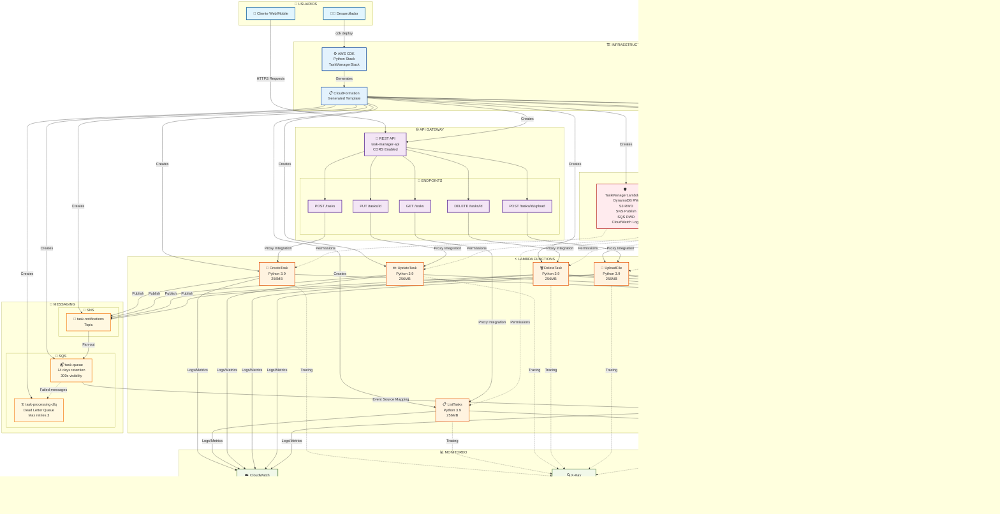

## 🎯 **Arquitectura TaskManager Serverless AWS**

### 📊 **Flujo de Datos Principal**

1. **👤 Usuario** → **🌐 API Gateway** → **⚡ Lambda** → **🗄️ DynamoDB**
2. **📎 Archivos** → **⚡ Lambda** → **📦 S3 Bucket**
3. **🔔 Eventos** → **📡 SNS** → **📨 SQS** → **⚡ SQS Processor**

### 🔄 **Flujo de Notificaciones Asíncronas**

```
Crear Tarea → SNS Topic → SQS Queue → Lambda Processor
     ↓             ↓           ↓            ↓
  DynamoDB    Fan-out to   Batch of 10   Process &
   Insert     subscribers   messages      Update DB
```

### 🏗️ **Componentes Clave**

| Servicio | Propósito | Configuración |
|----------|-----------|---------------|
| **API Gateway** | Punto de entrada REST | CORS habilitado, 5 endpoints |
| **Lambda Functions** | Lógica de negocio | Python 3.9, 256MB, 30s timeout |
| **DynamoDB** | Base de datos NoSQL | Pay-per-request, 2 GSI |
| **S3** | Almacenamiento archivos | Versioning, auto-delete |
| **SNS/SQS** | Mensajería asíncrona | Topic + Queue + DLQ |
| **IAM** | Seguridad | Permisos mínimos necesarios |

### 💰 **Escalabilidad y Costos**

- **🔄 Auto-scaling**: Todos los servicios escalan automáticamente
- **💵 Pay-per-use**: Solo pagas por lo que usas
- **🆓 Free Tier**: Primer año muy económico
- **🧹 Destrucción**: `cdk destroy` → $0 inmediato

---
*Diagrama generado para TaskManager Serverless - AWS CDK Python Stack*