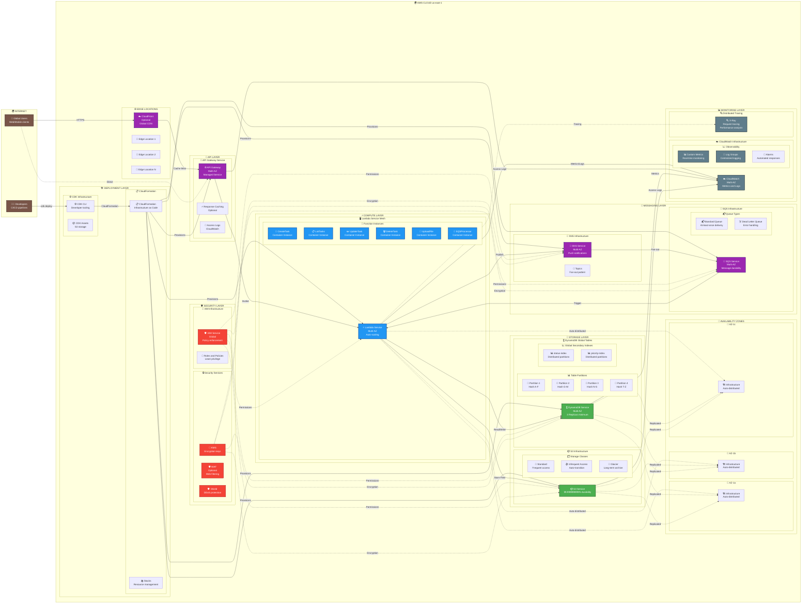

## 🏗️ **Infraestructura Física AWS - TaskManager Serverless**

### 🌍 **Distribución Geográfica**

| Capa | Multi-AZ | Replicación | Durabilidad |
|------|----------|-------------|-------------|
| **API Gateway** | ✅ Automática | 3+ AZ | 99.95% SLA |
| **Lambda** | ✅ Automática | Todas las AZ | 99.95% SLA |
| **DynamoDB** | ✅ Automática | 3+ replicas | 99.999999999% |
| **S3** | ✅ Automática | Cross-AZ | 99.999999999% |
| **SNS/SQS** | ✅ Automática | Multi-AZ | 99.9% SLA |

### ⚡ **Características de Escalabilidad**

#### 🔄 **Auto-Scaling Automático**
- **Lambda**: 0 → 1000 concurrent executions en segundos
- **DynamoDB**: Auto-scaling basado en demanda
- **API Gateway**: 10,000+ RPS por región  
- **S3**: Virtually unlimited storage
- **SNS/SQS**: Millions de mensajes por segundo

#### 📊 **Particionamiento Inteligente**
- **DynamoDB**: Hash partitioning automático por task_id
- **S3**: Distribución automática por prefijo
- **Lambda**: Container reuse + warm starts
- **API Gateway**: Edge-optimized endpoints

### 🛡️ **Resiliencia y Recuperación**

#### ⚠️ **Failure Handling**
```
AZ Failure → Automatic failover (< 30s)
Lambda Error → Retry + DLQ pattern  
DDB Throttling → Exponential backoff
S3 Error → Built-in retry logic
API Timeout → Circuit breaker pattern
```

#### 🔄 **Disaster Recovery**
- **RTO**: < 15 minutes (Recovery Time Objective)
- **RPO**: < 1 minute (Recovery Point Objective)  
- **Backup**: Point-in-time recovery available
- **Cross-Region**: Can be extended for global deployment

### 💰 **Optimización de Costos por Capa**

| Servicio | Modelo de Costo | Optimización |
|----------|-----------------|--------------|
| **Lambda** | Pay-per-invocation + duration | Function warming, memory tuning |
| **DynamoDB** | Pay-per-request | On-demand billing, GSI optimization |
| **S3** | Pay-per-storage + requests | Lifecycle policies, intelligent tiering |
| **API Gateway** | Pay-per-request | Caching, request optimization |
| **SNS/SQS** | Pay-per-message | Batch processing, message deduplication |

---
*Diagrama de infraestructura física completa - AWS Multi-AZ Deployment*