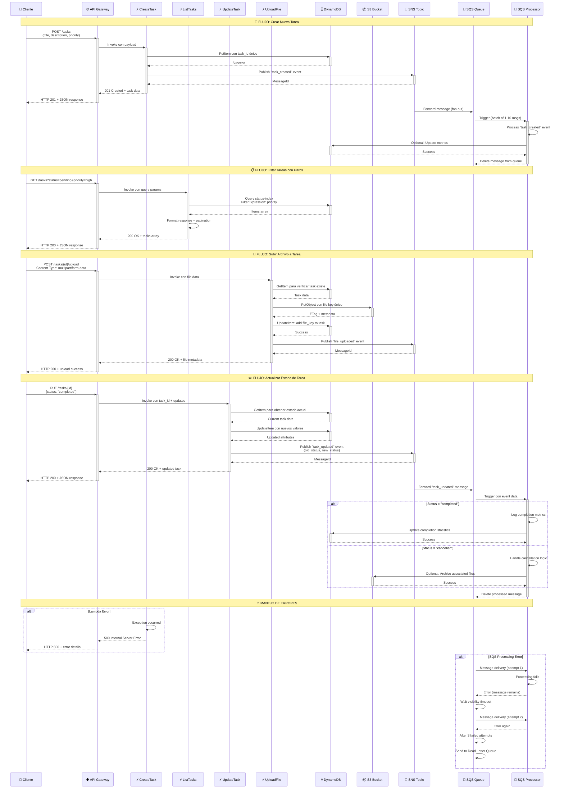

## 🔄 **Flujo de Datos TaskManager Serverless**

### 📊 **Patrones de Arquitectura Implementados**

1. **🎯 API Gateway Pattern**: Punto único de entrada con proxy integration
2. **⚡ Function-as-a-Service**: Funciones Lambda especializadas por operación
3. **🔄 Event-Driven Architecture**: SNS/SQS para procesamiento asíncrono
4. **📊 CQRS Ligero**: Separación read/write con índices optimizados
5. **🛡️ Security by Design**: IAM roles con permisos mínimos

### 🎭 **Scenarios de Uso Detallados**

#### 📝 **Crear Tarea**
```
Input: POST /tasks {"title": "Nueva tarea", "priority": "high"}
Process: Lambda → DynamoDB → SNS → SQS → Processor
Output: 201 Created + task_id + timestamp
Side Effects: Notificación asíncrona procesada
```

#### 📋 **Listar con Filtros**
```  
Input: GET /tasks?status=pending&priority=high&limit=10
Process: Lambda → DynamoDB GSI Query + Filter
Output: 200 OK + paginated results + next_token
Performance: Sub-100ms con índices optimizados
```

#### 📎 **Upload de Archivos**
```
Input: POST /tasks/123/upload + multipart file
Process: Lambda → S3 PutObject → DynamoDB UpdateItem → SNS
Output: 200 OK + file_url + metadata
Storage: S3 con versioning y lifecycle policies
```

### 🔒 **Seguridad Multi-Capa**

- **🌐 API Gateway**: Rate limiting, CORS, request validation
- **⚡ Lambda**: Execution role con permisos mínimos
- **🗄️ DynamoDB**: Encryption at rest, fine-grained access
- **📦 S3**: Bucket policies, object-level permissions
- **🔔 SNS/SQS**: Topic/queue policies, encryption en tránsito

---
*Diagrama de secuencia detallado - TaskManager Serverless AWS*